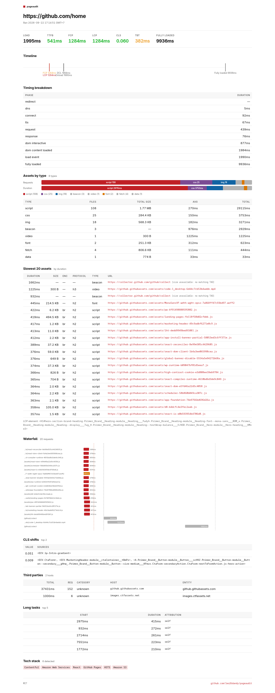

# pageaudit

[](https://github.com/leo26dandy/pageaudit/actions/workflows/test.yml)
[](LICENSE)
[](https://nodejs.org/)

A local page audit CLI. Point it at a URL, get back what's slow, who's watching, and what the site is built on. No account, no cloud, no waiting for PageSpeed Insights to hand back a number.

It runs a real Chromium via Playwright and reads what the browser itself measured. Same data source Chrome DevTools uses.



## What it shows

- **Assets by type.** Count, total size, average and total load duration for each kind (img, script, font, css, video, audio, doc).
- **Heaviest N assets** by real load duration. Default 15, override with `--top`. Filter to one kind with `--filter`. Table shows HTTP protocol (`h2`, `h3`) and content-encoding (`gz`, `br`) per asset.
- **Third-party services** grouped by host, labelled with entity and category (analytics, ads, cdn, tag-manager, social), sorted by total duration.
- **Tech stack.** WordPress, Elementor, WooCommerce, Next.js, Nuxt, React, Vue, Shopify, Cloudflare, and the rest.
- **Core Web Vitals.** TTFB, FCP, LCP, CLS, TBT. INP is omitted because it needs real user interaction, which a synthetic audit cannot fake.
- **LCP element identity.** Tag, id, class, and (for images) src of the element that painted the LCP. Useful when your LCP number is fine but you can't tell which element won.
- **CLS shift sources.** Top 5 shifts with the elements that moved.
- **Navigation timing split.** Redirect, DNS, connect, TLS, request, response, DOM interactive, DOM content loaded, load event, and fully-loaded (network-idle) time.
- **Long tasks.** Top 5 main-thread tasks over 50ms with start time and duration.
- **Fully-loaded time.** Approximated via network idle after the load event. Closer to GTmetrix's "Fully Loaded" than the raw `load` event.
- **Diff vs previous run** for the same URL. `--diff` reads a local snapshot and marks each asset with a delta.
- Local timestamps in the terminal. ISO timestamps in JSON for machines.

HTML report only, inline SVG, no extra dependencies:

- **Vitals cards** tinted green, amber, or red against Google's Core Web Vitals thresholds (FCP, LCP, CLS, TBT, TTFB). Load and fully-loaded stay neutral because they have no official threshold.
- **Timeline marker bar** with FCP, LCP, DOM content loaded, onload, and fully-loaded on one horizontal axis.
- **Waterfall chart** of up to 30 requests as horizontal bars ordered by start time, colored by asset type, with the lifecycle markers overlaid.
- **Assets-by-type segmented bars** for request count and total duration, with a color-key legend.

## Requirements

- Node.js 20+
- Playwright's Chromium, fetched separately with `npx playwright install chromium`. Playwright no longer downloads browsers automatically on `npm install`.

## Install

Clone and install:

```bash
git clone https://github.com/leo26dandy/pageaudit.git
cd pageaudit
npm install
npx playwright install chromium
```

Linux only, install Chromium's system deps:

```bash
sudo npx playwright install-deps chromium
```

Global link so `pageaudit <url>` works from any directory:

```bash
npm link
```

## Usage

```bash
node pageaudit.js https://example.com
```

With flags:

```bash
node pageaudit.js https://example.com --diff
node pageaudit.js https://example.com --fail
node pageaudit.js https://example.com --top 30
node pageaudit.js https://example.com --filter font
node pageaudit.js https://example.com --filter img,font,script
node pageaudit.js https://example.com --html report.html --md report.md
node pageaudit.js https://example.com --json | jq '.thirdParty[0:5]'
node pageaudit.js https://example.com --share            # requires `gh` CLI
node pageaudit.js https://example.com --timeout 60000
```

## Options

| Flag | Purpose |
|---|---|
| `--json` | Emit raw JSON to stdout |
| `--html <file>` | Write HTML report |
| `--md <file>` | Write Markdown report |
| `--share` | Upload HTML as a GitHub Gist (needs `gh auth login`) |
| `--diff` | Show diff vs previous run for this URL |
| `--fail` | Exit 1 if LCP or total asset duration regressed more than 10% vs previous run (strict `>`, CI-friendly) |
| `--top <n>` | Show top N heavy assets and 3rd parties (default `15`) |
| `--filter <types>` | Only show assets of the given types (comma-separated): `img,font,script,css,video,audio,data,doc` |
| `--timeout <ms>` | Page load timeout (default `30000`) |
| `-h`, `--help` | Show help |

Snapshots live at `~/.pageaudit/snapshots.json` and drive `--diff` and `--fail`.

## Tests

```bash
npm test
```

Runs `node --test` against `helpers.test.js`. Covers type inference, the TAO origin matrix, resource-size handling, regression detection, marker rendering across all three output formats, and backward compat for v0.5 vitals fields.

## Known limitations

- **Cross-origin size unknown.** When a resource is fetched from a different origin and its response does not carry a `Timing-Allow-Origin` header that matches the page origin (either `*` or the exact origin), the browser hides `transferSize` and `encodedBodySize` from `PerformanceResourceTiming`. Those rows are flagged `[size unavailable: no matching TAO]`. The marker only means byte accounting is hidden by the browser. The request itself may have loaded fine; the missing TAO does not by itself indicate a CORS-blocked response.
- **No INP.** INP requires real user interaction. A synthetic audit cannot measure it.
- **Tech-detection dataset is a snapshot.** `wappalyzer-core` reads the `technologies.json` bundled with `simple-wappalyzer` at install time. That dataset is not guaranteed to track the latest upstream Wappalyzer definitions. Bump `simple-wappalyzer` when detection accuracy drifts.
- **Single URL per run.** No crawl mode yet.

## Architecture

- `pageaudit.js` is the CLI entry. Argument parsing, Playwright orchestration, snapshot management.
- `helpers.js` holds pure logic: `inferType`, `isSizeUnavailable`, `resourceSize`, `hasRegression`, and the `NO_TAO` constant.
- `format.js` holds pure renderers: `toTable`, `toMarkdown`, `toHTML`, plus small formatters (`fmtMs`, `fmtBytes`, `fmtCls`, `fmtTime`, `shortType`).
- `helpers.test.js` is the `node --test` suite. No test-framework dependency.

Snapshots live at `~/.pageaudit/snapshots.json` and drive `--diff` and `--fail`.

## Changelog

See [CHANGELOG.md](CHANGELOG.md).

## License

[MIT](LICENSE) © Leo Dandy
